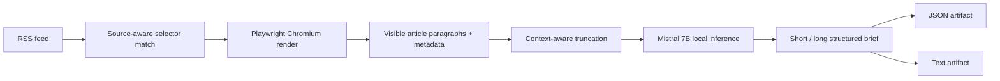

<div align="center">

<sub>Real photography by <a href="https://commons.wikimedia.org/wiki/File:Person_reading_a_newspaper_(Unsplash).jpg">Roman Kraft on Wikimedia Commons (CC0)</a>.</sub>

# Newsies
### Browser-aware news extraction plus local Mistral summaries—packaged as reproducible artifacts.

[](https://github.com/TanishC4444/Newsies/actions/workflows/newsbrief.yml)


[Pipeline](#pipeline) · [Extraction](#browser-aware-extraction) · [CLI](#command-line-usage) · [Automation](#automation)
</div>

---

## Overview

Newsies is a configurable command-line and GitHub Actions pipeline for producing structured news briefs from RSS feeds. Unlike simple feed readers, it renders article pages in Chromium, applies source-specific paragraph selectors with a generic fallback, collects metadata, and sends bounded article text to a local Mistral 7B GGUF model for short and optional long summaries. Results are exported as both JSON and readable text.

## Pipeline



## Browser-aware extraction

The scraper maintains URL-pattern-to-selector mappings and a generic fallback selector. JavaScript executed inside Playwright collects visible text and page metadata after rendering, which improves coverage for sites where static HTML extraction is insufficient.

`test.py` documents the motivation directly by comparing Newspaper extraction with Playwright on BBC articles and flagging short/poor results.

## Local intelligence

- A configurable GGUF model path defaults to a Mistral 7B instruction model.
- Article text is truncated against the context budget with reserved output space.
- Separate prompts generate concise and detailed briefs.
- Model output is parsed defensively as JSON.
- The CLI can skip long summaries to reduce runtime.

## Command-line usage

```bash
git clone https://github.com/TanishC4444/Newsies.git
cd Newsies
python -m venv .venv
source .venv/bin/activate
python -m pip install feedparser playwright llama-cpp-python
playwright install chromium
```

Example:

```bash
python newsbrief.py "https://feeds.bbci.co.uk/news/world/middle_east/rss.xml" \
  --source "BBC Middle East" \
  --category "Middle East" \
  --model models/mistral-7b-instruct-v0.2.Q5_K_M.gguf \
  --ctx 8192 \
  --max 3 \
  --json output/results.json \
  --text output/results.txt \
  --verbose
```

## Automation

The workflow runs daily at 06:00 UTC or manually with feed URL, maximum-article, and `skip_long` inputs. It installs Chromium and OpenBLAS-enabled `llama-cpp-python`, caches the Mistral weights, runs the CLI, and retains JSON/text outputs for 30 days.

## Repository map

```text
Newsies/
├── .github/workflows/newsbrief.yml
├── newsbrief.py      scraping, inference, CLI, exporters
├── test.py           Playwright vs Newspaper extraction comparison
└── README.md
```

## Engineering tradeoffs

- Browser rendering improves dynamic-page extraction but adds installation and runtime cost.
- Selector routing offers precision while requiring maintenance when publishers redesign pages.
- Local inference avoids a hosted text-generation API but makes Actions runs model- and CPU-heavy.
- JSON parsing provides structure, though model output still needs validation.
- No content deduplication or historical store is implemented; each run is an independent artifact.

## Skills demonstrated

Headless browser automation · RSS ingestion · source adapters · local LLM inference · context budgeting · CLI design · structured output parsing · CI caching · artifact pipelines

## Resume-ready highlight

> Built a browser-aware newsbrief pipeline that renders dynamic publisher pages with Playwright, applies source-specific extraction, runs local Mistral 7B summarization with context budgeting, and publishes structured JSON/text artifacts from GitHub Actions.

## License

No license file is currently included.

